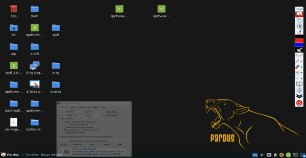
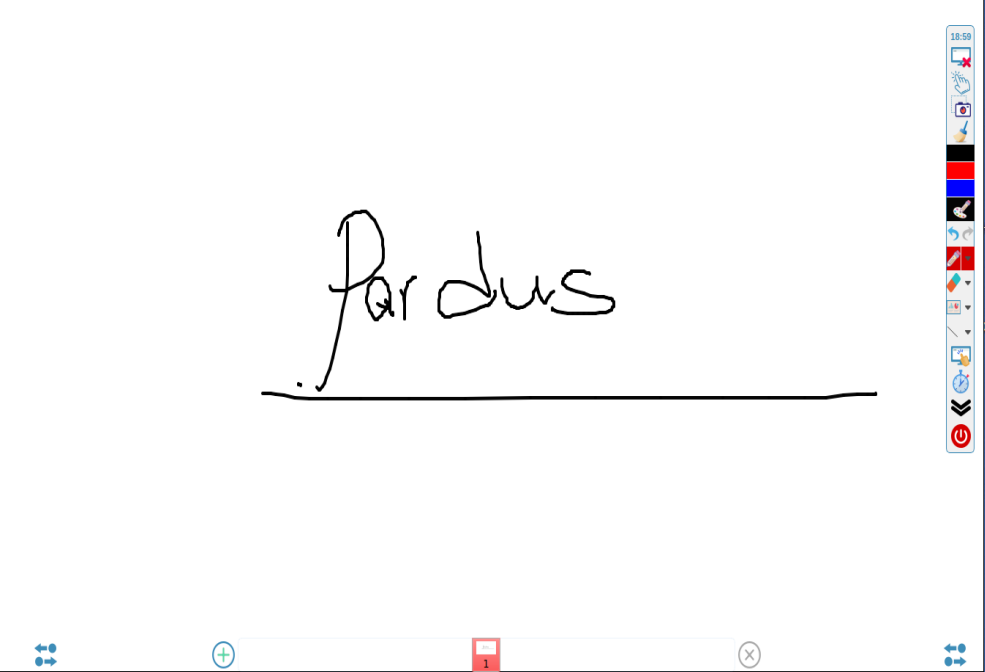
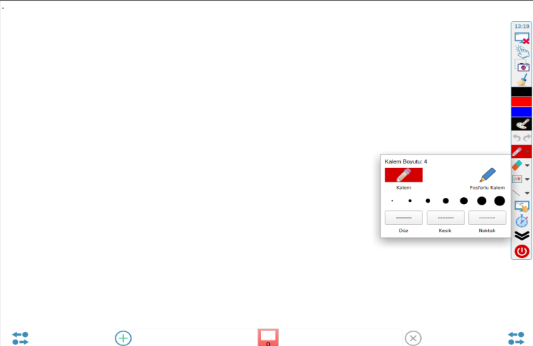
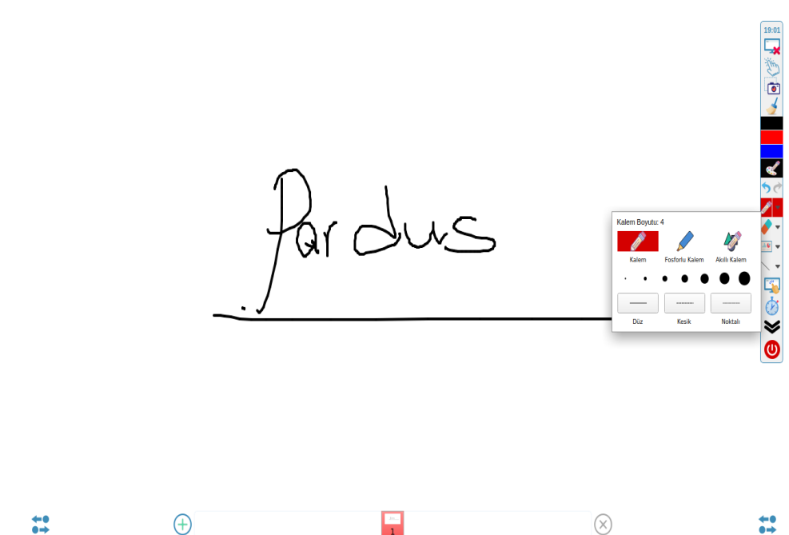
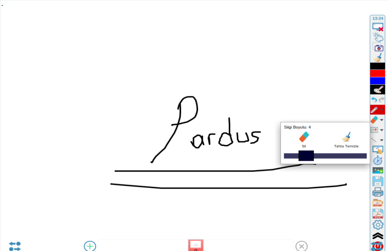
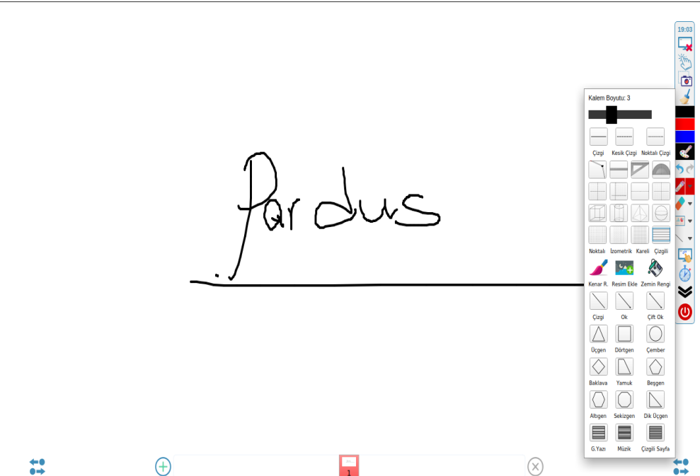
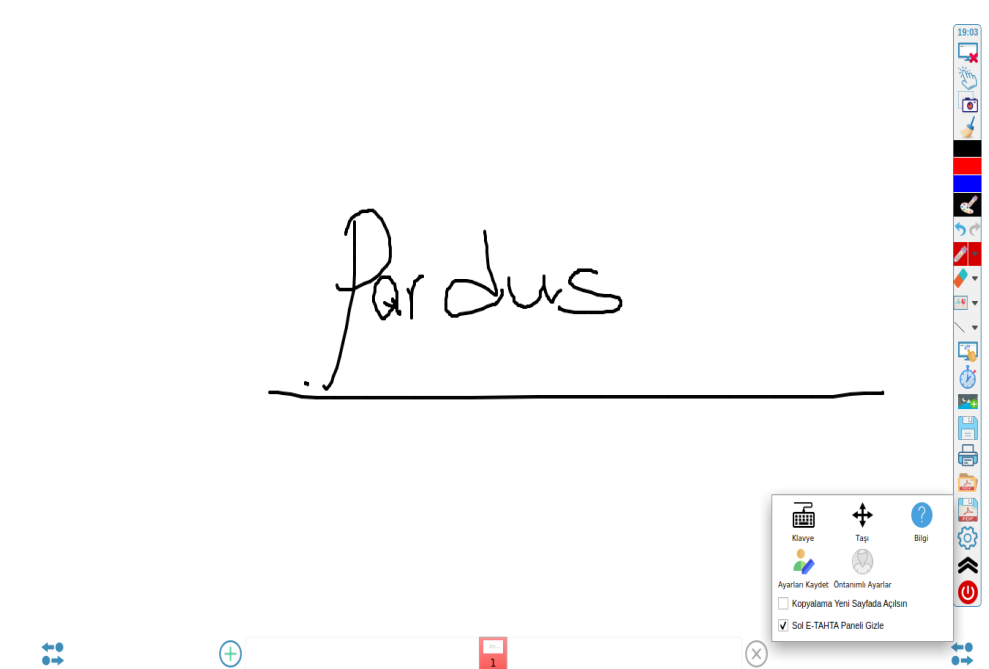
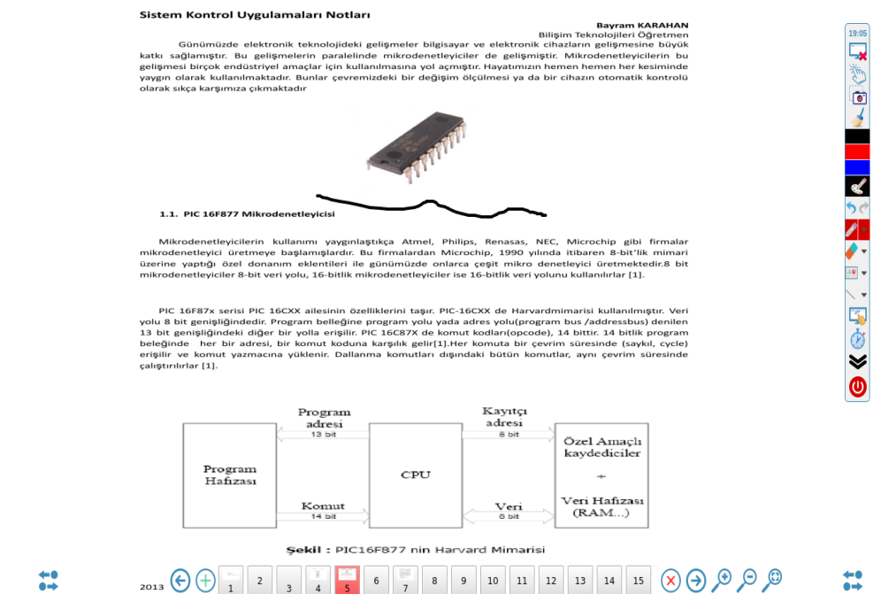
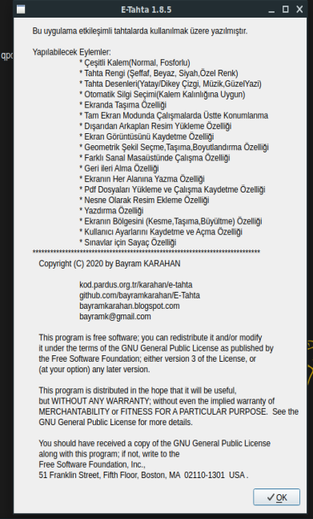

# E-Tahta
Ekranda Sanal Kalem ve Pdf Düzenleyici vb. İşlemler Yapabileceğimiz Yazılım.

Ekranda Sanal Kalem ve Pdf Düzenleyici vb. İşlemler Yapabileceğimiz Yazılım. E-Tahta
Uygulama Qt ortamında c++ ile yazılmıştır..
 Qt 5.11.2 versiyonu ile yazılmıştır.
 Uygulamada pdf için poppler kütüphanesi kullanılmıştır..
 gcc 4.9 versiyon kullanılmıştır..,
 Derlemek için kodu indiriniz.. kod adında bir dizinde açtığınızı varsayalım
 1-cd kod
 2-mkdir build
 3-cd build
 4-qmake ../E-Tahta.pro
 5-make&make clean
 6-make install
 Bu işlemleri hatasız yaparsanız uygulama derlenecek ve sisteme yüklenecektir..
  etap5 üzerinde derlemek için debhelper 8, libgcc 4.9 ve pro dosyasında opencv imcodecs kütüphanesi iptal edilmesi gerekiyor..
